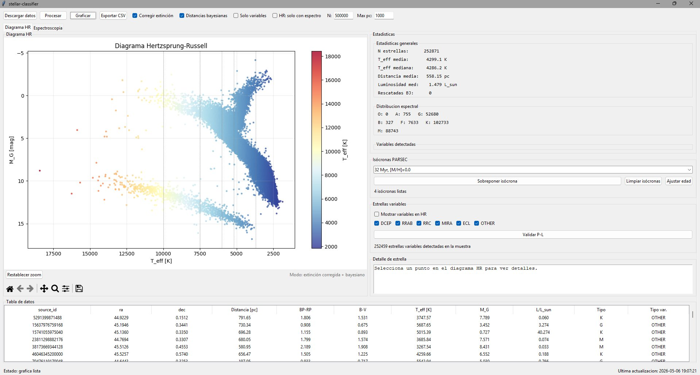
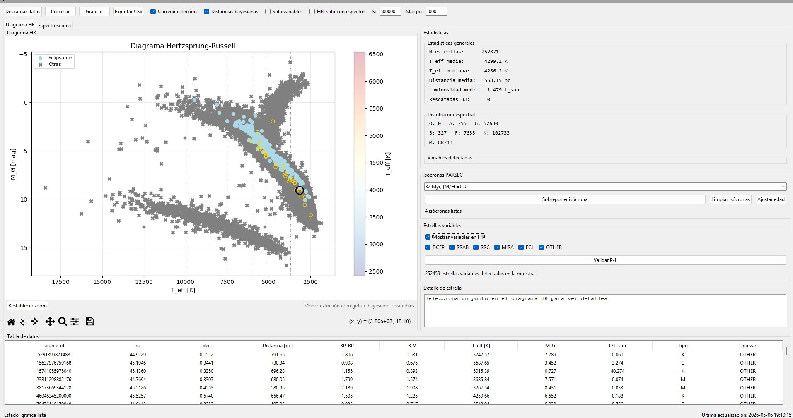
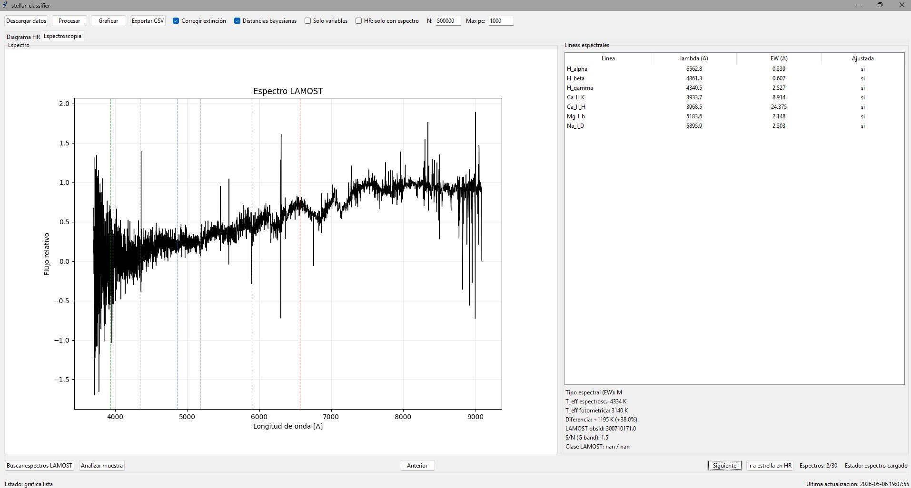

# stellar-classifier

[](https://github.com/Kuraos/stellar-classifier/actions/workflows/ci.yml)
[](https://www.python.org)
[](https://www.gnu.org/licenses/gpl-3.0)

Pipeline de clasificación espectral estelar con datos reales de **Gaia DR3** (ESA).
Descarga muestras estelares, deriva parámetros físicos mediante relaciones empíricas
calibradas, genera diagramas Hertzsprung–Russell interactivos y cruza con espectros
reales de LAMOST DR9 para comparación fotométrica–espectroscópica.

Desarrollado como proyecto académico personal explorando astronomía estelar observacional
con herramientas de análisis de datos científicos en Python.

---

## Capturas de pantalla

### Interfaz principal tras descarga y procesamiento



252 871 estrellas con corrección de extinción (Bayestar2019) y distancias bayesianas
(Bailer-Jones 2021). La distribución espectral muestra el dominio esperado de tipos K y M
conforme a la función inicial de masa.

### Variables estelares resaltadas en el HR



Modo de resaltado de variables Gaia DR3. Las estrellas eclipsantes (azul) y otras
categorías se superponen sobre la secuencia principal atenuada. El marcador circular
indica la estrella actualmente seleccionada.

### Espectroscopía LAMOST DR9



Espectro real descargado de LAMOST DR9 con anchos equivalentes ajustados mediante
perfil gaussiano. La comparación T_eff fotométrica vs. espectroscópica valida de forma
independiente la temperatura derivada de la fotometría Gaia.

---

## Características

| Módulo | Descripción | Referencia |
|--------|-------------|------------|
| Temperatura efectiva | Fórmula analítica derivada de la ley de Planck | Ballesteros (2012) |
| Corrección de extinción | Mapa Bayestar2019 vía `dustmaps` | Green et al. (2019) |
| Distancias bayesianas | Posterior geométrico + fotométrico | Bailer-Jones et al. (2021) |
| Isócronas PARSEC | Carga, filtrado y ajuste de edad por chi-cuadrado | Bressan et al. (2012) |
| Variables Gaia DR3 | Clasificación DCEP/RRAB/ECL/MIRA/ROT con relaciones P-L | Leavitt (1908), Catelan (2009) |
| Espectros LAMOST DR9 | Cross-match, descarga FITS, anchos equivalentes, T_eff espectroscópica | Zhao et al. (2012), Gray (2008) |

---

## Instalación

### Requisitos

- Python 3.11 o superior
- Tkinter — incluido en Python estándar. En Linux: `sudo apt install python3-tk`
- ~300 MB de espacio para el mapa de extinción Bayestar2019 (se descarga una vez)

### Dependencias

```bash
pip install -r requirements.txt --break-system-packages
```

Para desarrollo (mypy, linters):

```bash
pip install -r requirements-dev.txt --break-system-packages
```

---

## Uso rápido

```bash
python main.py
```

### Flujo recomendado en la GUI

1. Ajustar **N** (número de estrellas) y **Max pc** (distancia máxima).
2. Click en **Descargar datos** — la descarga corre en segundo plano sin bloquear la interfaz.
3. Click en **Procesar** — deriva T_eff, M_G, L/L_sun y tipo espectral.
4. Activar opcionalmente **Corregir extinción** y/o **Distancias bayesianas** antes de procesar.
5. Click en **Graficar** — genera el diagrama HR embebido con zoom y pan.
6. Panel lateral: **Isócronas PARSEC** para superponer modelos teóricos o ajustar edad.
7. Panel lateral: **Estrellas variables** para resaltar tipos en el HR y validar relaciones P-L.
8. Pestaña **Espectroscopía**: click en **Buscar espectros LAMOST** para el cross-match.
9. Click sobre cualquier punto del HR con espectro disponible → se muestra automáticamente en la pestaña de espectroscopía con líneas ajustadas.

---

## Uso programático

Los módulos pueden usarse de forma independiente sin lanzar la GUI.

### Descarga y procesamiento básico

```python
from data.download import query_gaia_sample
from src.temperature import bv_from_bprp, teff_from_bv, absolute_magnitude, spectral_type
from src.hr_diagram import plot_hr

# Descargar 5000 estrellas dentro de 200 pc
df = query_gaia_sample(n_stars=5000, max_dist_pc=200)

# Derivar parámetros físicos
df["B_V"] = bv_from_bprp(df["bp_rp"].to_numpy())
df["teff"] = teff_from_bv(df["B_V"].to_numpy())
df["M_G"] = absolute_magnitude(df["phot_g_mean_mag"].to_numpy(), df["parallax"].to_numpy())
df["spectral_type"] = spectral_type(df["teff"].to_numpy())

# Generar y guardar el diagrama HR
fig = plot_hr(df)
fig.savefig("hr_diagram.png", dpi=150, bbox_inches="tight")
```

### Corrección de extinción

```python
from src.extinction import apply_extinction_correction

# Requiere Bayestar2019 descargado (~300 MB en ~/.dustmaps/)
df_corr = apply_extinction_correction(df)
print(f"A_V media: {df_corr['A_V'].mean():.3f} mag")
```

### Distancias bayesianas

```python
from src.distances import best_distance_bayesian

df["distance_pc_bayesian"] = best_distance_bayesian(
    df["r_med_photogeo"], df["r_med_geo"], df["parallax"]
)
```

### Isócronas PARSEC

```python
from src.isochrones import load_isochrone, fit_best_age
import numpy as np

# Cargar isócrona de 1 Gyr con metalicidad solar
iso = load_isochrone(log_age=9.0, metallicity=0.0)

# Buscar la mejor edad en un grid
result = fit_best_age(df, age_grid=np.arange(8.0, 10.1, 0.1))
print(f"Edad mejor ajuste: {result['best_age_label']}, chi2 = {result['min_chi2']:.3f}")
```

### Estrellas variables

```python
from src.variables import add_variability_columns

df = add_variability_columns(df)
print(df["variable_type"].value_counts())
print(f"Estrellas con distancia P-L: {df['distance_pc_PL'].notna().sum()}")
```

### Espectros LAMOST DR9

```python
from src.lamost import crossmatch_lamost, analyse_star_spectrum

# Cross-match con el catálogo LAMOST DR9 en Vizier
df_match = crossmatch_lamost(df, radius_arcsec=2.0, max_stars=500)
print(f"Estrellas con espectro: {len(df_match)}")

# Analizar el espectro de una estrella
if not df_match.empty:
    row = df_match.iloc[0]
    result = analyse_star_spectrum(
        source_id=row["source_id"],
        obsid=row["obsid"],
        teff_photometric=float(df.loc[df["source_id"] == row["source_id"], "teff"].iloc[0]),
    )
    if result["success"]:
        print(f"Tipo espectral (EW): {result['spectral_type_spec']}")
        print(f"T_eff espectroscópica: {result['teff_spectroscopic']:.0f} K")
        print(f"T_eff fotométrica:     {result['teff_photometric']:.0f} K")
        print(f"Diferencia:            {result['teff_diff_K']:+.0f} K ({result['teff_diff_pct']:+.1f}%)")
```

---

## Física implementada

### Temperatura efectiva desde fotometría

La conversión BP−RP → T_eff se hace en dos pasos. Primero se transforma el color
Gaia al sistema Johnson con la relación empírica de Evans et al. (2018):

```
B-V = 0.0981 + 0.7119 * (BP-RP) + 0.0718 * (BP-RP)^2
```

Luego se aplica la fórmula de Ballesteros (2012), derivada analíticamente de la ley de
Planck integrando sobre los filtros Johnson B y V:

```
T_eff = 4600 * [ 1/(0.92*(B-V) + 1.7) + 1/(0.92*(B-V) + 0.62) ]   [K]
```

Válida para 0.0 < B−V < 2.0, error típico ~1% en secuencia principal FGK.

### Magnitud absoluta y luminosidad

```
M_G = m_G + 5 + 5 * log10(parallax_mas / 1000)
L/L_sun = 10^((4.74 - M_G) / 2.5)
```

### Temperatura espectroscópica desde W(H-alpha)

Relación lineal empírica calibrada contra Gray (2008), válida para tipos AFGK:

```
T_eff [K] ~ 456 * W_Halpha [A] + 4180
```

Error típico < 8% para AFGK. La calibración refleja la curva creciente de intensidad de
la serie de Balmer en el lado frío del pico (T_eff < 10 000 K).

---

## Estructura del proyecto

```
stellar-classifier/
├── main.py                     # Punto de entrada
├── requirements.txt
├── requirements-dev.txt
├── pytest.ini
│
├── data/
│   ├── download.py             # Consulta ADQL a Gaia DR3 vía TAP HTTP
│   └── isochrones/             # Archivos PARSEC CMD 3.7 (sintéticos incluidos)
│
├── src/
│   ├── temperature.py          # Ballesteros (2012), Evans et al. (2018)
│   ├── extinction.py           # Bayestar2019 vía dustmaps
│   ├── distances.py            # Bailer-Jones et al. (2021)
│   ├── hr_diagram.py           # Generación del diagrama HR
│   ├── statistics.py           # Métricas de muestra para la GUI
│   ├── isochrones.py           # Carga, filtrado y ajuste PARSEC
│   ├── variables.py            # Variables Gaia DR3, relaciones P-L
│   ├── lamost.py               # Cross-match y análisis LAMOST DR9
│   ├── line_fitting.py         # Ajuste gaussiano de líneas de absorción
│   └── healpy.py               # Shim de compatibilidad para dustmaps
│
├── gui/
│   ├── app.py                  # Ventana principal Tkinter
│   ├── widgets.py              # Paneles reutilizables
│   └── plots.py                # Canvas matplotlib embebido
│
├── tests/                      # Suite pytest (sin dependencias de red)
│   ├── conftest.py
│   └── test_*.py
│
├── docs/
│   └── screenshots/            # Capturas de pantalla de la GUI
│
└── results/                    # Figuras y CSV exportados (no versionados)
```

---

## Tests

```bash
# Suite completa sin red
pytest -q -m "not online"

# Tests que requieren conexión real (Gaia, LAMOST, Vizier)
RUN_ONLINE_TESTS=1 pytest -q -m "online"

# Con reporte de cobertura
pytest -q -m "not online" --cov=src --cov-report=term-missing

# Verificación de tipos estáticos
mypy src/ data/ main.py
```

---

## Datos externos requeridos

### Mapa de extinción Bayestar2019

Se descarga automáticamente la primera vez que se activa la corrección de extinción.
Para predescargar manualmente (~300 MB en `~/.dustmaps/`):

```python
from dustmaps.bayestar import fetch
fetch()
```

### Isócronas PARSEC

Descarga manual desde http://stev.oapd.inaf.it/cgi-bin/cmd con sistema fotométrico
`Gaia DR3 (Vegamags)` y metalicidad `[M/H] = 0.0`. El repositorio incluye archivos
sintéticos mínimos en `data/isochrones/` para ejecutar los tests sin descarga externa.

### Espectros LAMOST DR9

Se descargan automáticamente y se almacenan en caché local en `data/spectra/`
(excluidos del repositorio). Acceso manual: http://www.lamost.org/dr9/

---

## Referencias

| Referencia | Uso |
|------------|-----|
| Ballesteros (2012), EPL, 97, 34008 | Fórmula T_eff(B−V) |
| Evans et al. (2018), A&A, 616, A4 | Transformación Gaia BP−RP → Johnson B−V |
| Gaia Collaboration et al. (2022), A&A, 674, A1 | Catálogo DR3 |
| Bailer-Jones et al. (2021), AJ, 161, 147 | Distancias bayesianas |
| Green et al. (2019), ApJ, 887, 93 | Mapa de extinción Bayestar2019 |
| Bressan et al. (2012), MNRAS, 427, 127 | Isócronas PARSEC |
| Zhao et al. (2012), RAA, 12, 723 | Catálogo LAMOST |
| Gray (2008), The Observation and Analysis of Stellar Photospheres | Clasificación espectral, W(H-alpha) |
| Leavitt & Pickering (1912), Harvard Circ., 173 | Relación P-L Cefeidas |
| Catelan et al. (2004), ApJS, 154, 633 | Relación P-L RR Lyrae |

---

## Licencia

GNU General Public License v3.0 — ver [LICENSE](LICENSE).